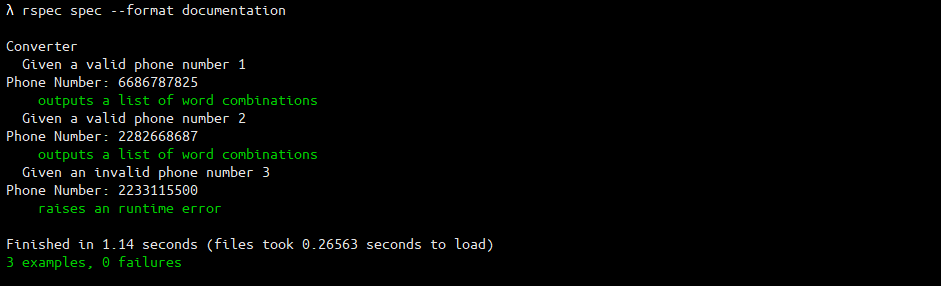

# Phone Number to Words Converter

Given a 10 digit phone number, you should return all possible words or combinations of words from the provided dictionary, that can be mapped back as a whole to the number.

With this we can generate numbers like 1-800-motortruck which is easier to remember than 1-800-6686787825.

The phone number mapping to letters is as follows:

```
2 = a b c
3 = d e f
4 = g h i
5 = j k l
6 = m n o
7 = p q r s
8 = t u v
9 = w x y z
```

The phone numbers will never contain a 0 or 1. Words have to be at least 3 characters.

To give you an initial idea, here are some numbers that return (a lot of) results.

`6686787825` returns a (long) list with at least these word combinations:

```
motortruck
motor, truck
motor, usual
noun, struck
not, opt, puck
```

`2282668687` returns a (long) list with at least these word combinations:

```
catamounts
acta, mounts
act, amounts
act, contour
cat, boot, our
```

The conversion of a 10 digit phone number should be performed within 1000ms.

The solution should contain a library with at least a public method that we can call with a 10 digit number, which returns an array with all results. We will use this method to test a set of random numbers and verify the output.

The complete solution should include documentation and unit tests which should at least include the two provided examples.

Using a plain text full English Scrabble dictionary such as this one: Dictionary

## Getting Started

Following assumptions have been made for the program.

- Number should be 10 digits
- Number will not contain 0 or 1 digits
- The matching word's length is at least 3 characters

## Installing

The given instruction will guide to downloading and running a local copy of the project on your local machine.

A step by step series of examples that tell you have to get a development environment running

1. Clone / Download the code.
2. Go to the repository folder `cd number_to_words`
3. Code is tested in ruby version `ruby 2.7.0p0`. It may work in other versions as well.
4. Install bundler, if not installed: `gem install bundler`
5. Get all the dependencies: `bundle install`

## Execution

A public method 'get_word_combinations(phone_number)' is exposed for providing the program with the phone number. The program will then return an arrays of array with words for the given phone number.

- Run the program `ruby lib/converter.rb`
- Run the tests: `rspec spec --format documentation`
- Run the benchmark `ruby lib/benchmark.rb`

## Output

### Program Output


### Test Output



### Benchmark Output


